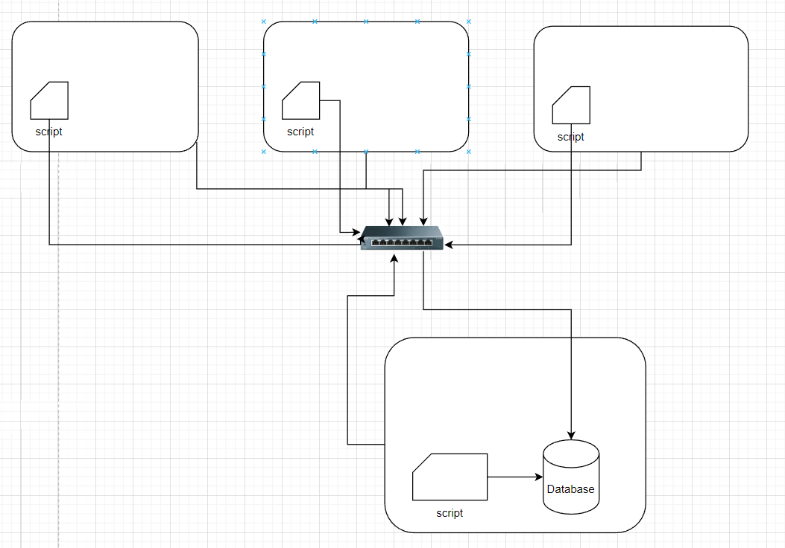

# Linux Cluster Monitoring Agent
The Linux Cluster Monitoring Agent is a powerful and scalable tool designed to collect and analyze real-time data on the hardware and resource usage of each node in a cluster. This agent is installed on each node and uses Bash and SQL scripting to efficiently gather relevant system data. The collected data is then stored in a PostgreSQL database for further analysis and use by the cluster administration team.

By deploying this monitoring agent, users can easily keep track of the cluster's overall performance, identify potential issues and bottlenecks, and make informed decisions to optimize the system's efficiency and productivity. The use of Bash and SQL scripting, along with the crontab, ensures that the system is highly efficient and scalable, allowing for easy management of large clusters.

The Linux Cluster Monitoring Agent project utilizes several technologies, including Docker for managing the PostgreSQL instance, IntelliJ IDEA for developing the application, and crontab for automating the process.

## Quick Start
Follow the steps below to quickly get started with the Linux Cluster Monitoring Agent project:
  1. Start a Postgres SQL instance using the psql_docker.sh script:  `./scripts/psql_docker.sh start`
  2. Create the necessary tables using the ddl.sql script:    `psql -h HOST_NAME -p 5432 -U USER_NAME -d DB_NAME -f ddl.sql`
  3. Use the host_info.sh script to fetch hardware specifications of the nodes and store them in the database:    `./scripts/host_info.sh psql_host psql_port db_name psql_user psql_password`
  4. Use the host_usage.sh script to fetch hardware usage data into the database:    `./scripts/host_usage.sh psql_host psql_port db_name psql_user psql_password`
  5. Automate the execution of host_usage.sh with the Crontab setup:    `* * * * * bash /path_to/host_usage.sh localhost 5432 db_name db_user db_password > /tmp/host_usage.log`

## Implementation
I set up a PSQL instance with a Docker container and created tables to store hardware specs and resource usage data using SQL scripts. I then used Bash scripts, host_info.sh and host_usage.sh, to collect the data and persist it to the PSQL instance. Finally, I automated the process with crontab.

## Architecture

## Scripts
- **psql_docker.sh**
  The SQL statements within this script are used to create two tables, host_info and host_usage, in a PostgreSQL database. These tables are designed to store hardware information and resource usage data.
- **host_info.sh** 
  The purpose of this script is to collect hardware information from the host machine and insert it into a PostgreSQL database. To use the script, run   `./scripts/host_info.sh psql_host psql_port db_name psql_user psql_password`
- **host_usage.sh**
  The purpose of this script is to retrieve usage data from the node and store it in a PostgreSQL database. To use the script, run
  `./scripts/host_usage.sh psql_host psql_port db_name psql_user psql_password`
- **ddl.sql** 
  This script is responsible for defining the tables used to store the retrieved hardware and usage data in a PostgreSQL database.
- **crontab** 
  This script sets up automatic uploads the usage data every minute and upload it to a PostgreSQL database. the script
  `* * * * * bash /path_to/host_usage.sh localhost 5432 db_name db_user db_password > /tmp/host_usage.log`

## Database Modeling
### host_info Table
| Column Name       | Data Type         | Constraints                 |
|-------------------|-------------------|-----------------------------|
| id                | SERIAL            | PK NOT NULL                 |
| hostname          | VARCHAR           | UNIQUE NOT NULL             |
| cpu_number        | INT2              | NOT NULL                    |
| cpu_architecture  | VARCHAR           | NOT NULL                    |
| cpu_model         | VARCHAR           | NOT NULL                    |
| cpu_mhz           | FLOAT8            | NOT NULL                    |
| l2_cache          | INT4              | NOT NULL                    |
| timestamp         | TIMESTAMP         | NULL                        |
| total_mem         | INT4              | NULL                        |
### host_uage Table
| Column Name       | Data Type         | Constraints                 |
|-------------------|-------------------|-----------------------------|
| timestamp         | TIMESTAMP         | NOT NULL                    |
| host_id           | SERIAL            | FK NOT NULL                 |
| memory_free       | INT4              | NOT NULL                    |
| cpu_idle          | INT2              | NOT NULL                    |
| cpu_kernel        | INT2              | NOT NULL                    |
| disk_io           | INT4              | NOT NULL                    |
| disk_available    | INT4              | NOT NULL                    |

## Tests
The testing process involved running the host_info.sh and host_usage.sh scripts and checking the tables in the PostgreSQL database for the expected hardware and usage data. The ddl.sql script was tested by querying the database tables after connecting to the psql instance. Any errors were addressed before the application was deployed.

Once the testing was complete, the application was deployed using crontab to automate the data collection process. The collected data was stored in the PostgreSQL database at regular intervals for future analysis.

## Deployment
To automate the collection of CPU and memory usage data and store it in a PostgreSQL database, I used the crontab command to schedule the execution of the host_usage.sh script at one-minute intervals. The command used was: 
   `* * * * * bash /path_to/host_usage.sh localhost 5432 db_name db_user db_password > /tmp/host_usage.log`
   This allowed the monitoring agent to collect and persist hardware usage data regularly. The PostgreSQL database was managed using Docker.

## Improvement
- implement integration tests to ensure that the entire system is functioning correctly and as expected.
